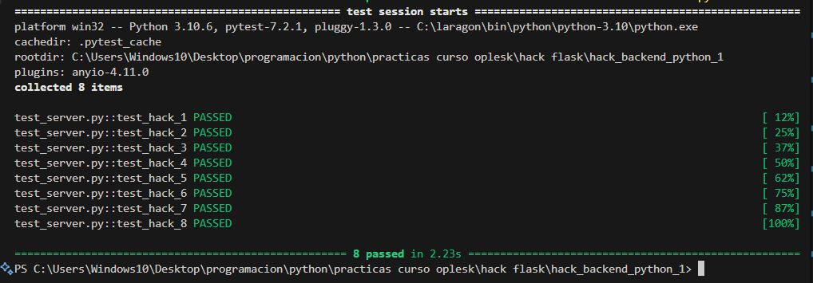

# SOCIAL OPLESK
### 🏴‍☠️ HACKS - BACKEND - 1

## Proyecto
**Elias Cordova**  
*Desarrollador Full Stack*  

<br/>

📚 tutorial de flask - 1 [tutorial](https://towardsdatascience.com/creating-restful-apis-using-flask-and-python-655bad51b24)
<br/>
📚 tutorial de flask - 2 [tutorial](https://www.moesif.com/blog/technical/api-development/Building-RESTful-API-with-Flask/)
<br/>
📚 tutorial de flask - 3 [tutorial](https://www.digitalocean.com/community/tutorials/processing-incoming-request-data-in-flask)
---

```diff
- NOTA HACER LAS PRÁCTICAS MEDIANTE VISUAL STUDIO CODE  
```

```diff
* Clonar el repositorio https://github.com/SocialOplesk/hack_backend_python_1.git

* Instalar las dependencias:
  pip install -r requirements.txt 

* Ejecutar servidor app.py en terminal: flask run --debug

* Ejecutar test a nivel global en terminal: pytest -v

* Ejecutar test por cada hack en terminal: pytest -v test_server.py::test_hack_1

* Debes tener en ejecución el servidor app.py para ejecutar correctamente el testing  
```
<br/>

|Hacks | Details | 
|----------|---------|
| H-1      | {'payload':'success'} |
| H-2      | {'payload':'success'} |
| H-3      | {'payload':'success'} | 
| H-4      | {'payload':'success'} |
| H-5      | {'payload':[]} |
| H-6      | {'payload': {'email':email,'name': name}}|
| H-7      | {'payload': {'email':email,'name':name,'id':id,}} |
| H-8      | {'payload': {'email':email,'name':name,'id':id,}}  | 
<br/> 

## 🏆 H-1 

```sh
CREATE AN ENDPOINT THAT RESPONDS IF THE REQUEST IS OF TYPE "GET"

ENDPOINT:("/users")
METHOD: "GET"
TYPE: JSON

output => {'payload':'success'}
```
<br/>


## 🏆 H-2
```sh
CREATE AN ENDPOINT THAT RESPONDS IF THE REQUEST IS OF TYPE "POST"

ENDPOINT:("/user")
METHOD: "POST"
TYPE: JSON

output => {'payload':'success'}
```
<br/>

## 🏆 H-3
```sh
CREATE AN ENDPOINT THAT RESPONDS IF THE REQUEST IS OF TYPE "DELETE"

ENDPOINT:("/user")
METHOD: "DELETE"
TYPE: JSON

output => {'payload':'success'}
```
<br/>

## 🏆 H-4
```sh
CREATE AN ENDPOINT THAT RESPONDS IF THE REQUEST IS OF TYPE "PUT"

ENDPOINT:("/user")
METHOD: "PUT"
TYPE: JSON

output => {'payload':'success'}

```
<br/>

## 🏆 H-5
```sh
CREATE AN ENDPOINT THAT RESPONDS IF THE REQUEST IS OF TYPE "GET"

ENDPOINT:("/api/v1/users")
METHOD: "GET"
TYPE: JSON

output => {'payload':[]}
```
<br/>


## 🏆 H-6
```sh
CREATE AN ENDPOINT THAT RESPONDS IF THE REQUEST IS OF TYPE "POST"

ENDPOINT:("/api/v1/user")
METHOD: "POST"
TYPE: JSON
INPUT: http://localhost:5000/api/v1/user?email=foo@foo.foo&name=fooziman

output =>  {
        'payload': {
            'email':email,
            'name':name,
        }
    }
```
<br/>

## 🏆 H-7
```sh
CREATE AN ENDPOINT THAT RESPONDS IF THE REQUEST IS OF TYPE "POST"

ENDPOINT:("/api/v1/user/add")
METHOD: "POST"
TYPE: JSON
INPUT: "request.form.get('key')"

output => {
        'payload': {
            'email':email,
            'name':name,
            'id':id,
        }
    }
```
<br/>

## 🏆 H-8
```sh
CREATE AN ENDPOINT THAT RESPONDS IF THE REQUEST IS OF TYPE "POST"

ENDPOINT:("/api/v1/user/create")
METHOD: "POST"
TYPE: JSON
INPUT: "request.get_json()"

output => {
        'payload': {
            'email':email,
            'name':name,
            'id':id,
        }
    }
```
<br/>
<br/>

## 🏆 Logrado 🏆


